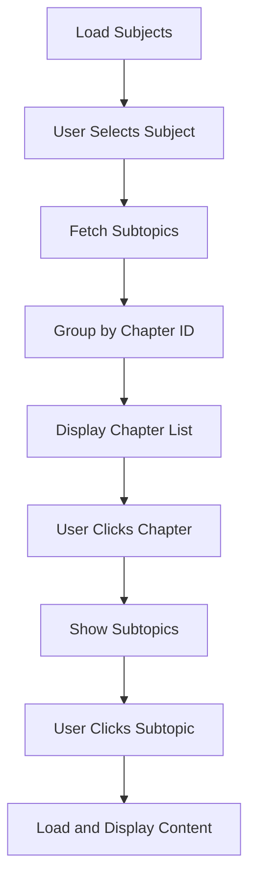

# AI Tutor Frontend

## Overview

React-based frontend for the AI Tutor system. You use this to navigate chapters and view educational content.

## Quick Start

```bash
# Development
cd app/frontend
npm run dev

# Production build
npm run build

# Deploy to Flask static folder
Copy-Item -Path "dist/*" -Destination "../static/frontend/" -Recurse -Force
```

## Components

### ChapterSidebar

Located at `src/components/ChapterSidebar.jsx`

**Purpose:** Left sidebar for subject and chapter navigation.

**Features:**
- Subject selector dropdown
- View mode toggle (Content/Exercise/Exam)
- Chapter list with extracted numbers

**Chapter Number Extraction:**

Topic IDs follow the format `{subject_id}_ch{number}`. The component extracts numbers using:

```javascript
const chNumMatch = s.chapter_id.match(/ch(\d+)$/i);
const chNum = chNumMatch ? parseInt(chNumMatch[1], 10) : 0;
```

Example: `engineering_gcse_8852_ch1` → displays as `1. Engineering materials`

### SubtopicSidebar

Located at `src/components/SubtopicSidebar.jsx`

**Purpose:** Right sidebar showing subtopics for the selected chapter.

### MiddleArea

Located at `src/components/MiddleArea.jsx`

**Purpose:** Main content display area with markdown and HTML rendering.

## API Endpoints

| Endpoint | Method | Description |
|----------|--------|-------------|
| `/api/db/subjects` | GET | List all subjects |
| `/api/db/subjects/{id}/all-subtopics` | GET | Get subtopics grouped by chapter |
| `/api/db/content/{subtopic_id}` | GET | Get content for a subtopic |

## Data Flow



## Recent Changes

See `CHANGELOG.md` for detailed change history.
